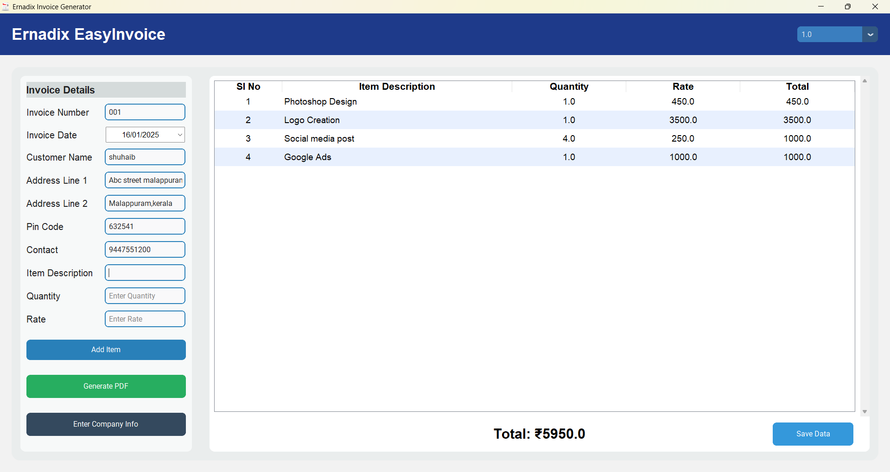

# Ernadix EasyInvoice Generator

**Ernadix EasyInvoice Generator** is an easy-to-use, feature-rich application for generating invoices with built-in QR codes for UPI payments and a hidden dashboard for managing your data.

---

## Features

- Quick and professional invoice generation.
- QR code integration for seamless UPI payments.
- Hidden dashboard accessible via `Ctrl + D`.
- Export recorded data with a single click.
- Total revenue display on the dashboard.
- Edit or delete items directly from the preview table.
- Company information entry window with logo upload support.
- Modern and user-friendly interface.

---

## Keyboard Shortcuts

- **Ctrl + R**: Clear entered data in the invoice creation interface.
- **Ctrl + A**: Add or update an item.
- **Ctrl + D**: Open the hidden dashboard.
- **Ctrl + G**: Generate a PDF invoice.
- **Ctrl + S**: Save data only to the dashboard without creating an invoice.

---

## Screenshots

### Invoice Generator Interface

### Company Info Entry Window

### Sample Invoice with QR Code

### Hidden Dashboard

---

## Installation

1. Download the latest version from [here](https://github.com/shuhaibvvm/Ernadix-EasyInvoice/releases/download/v1.5/Ernadix.Easy-Invoice.zip ).
2. Extract the downloaded zip file (if applicable).
3. Run `setup.exe` to start the application.

---

## How to Use

1. Launch the application.
2. Fill out the invoice form with details (e.g., customer name, address, item details).
3. Click **Generate Invoice** to preview and save the invoice.
4. Share the invoice with the QR code for easy UPI payment.
5. Access the hidden dashboard by pressing `Ctrl + D`:
   - View all recorded data.
   - Export data for analysis.
   - Check total revenue at the bottom of the dashboard.

---

## Technologies Used

- **Python**: Core programming language.
- **CustomTkinter**: Modern UI framework.
- **SQLite**: Local database for storing records.
- **qrcode**: For generating QR codes for UPI payments.

---

## Payment Details

The current price for a license is **₹2000**.  
**This price is subject to change. Please confirm the price before making the payment.**

### Contact for Price Confirmation:
- **Call or WhatsApp**: +91 9447551200, +91 9567560972
- **Email**: [Ernadixofficial@gmail.com](mailto:Ernadixofficial@gmail.com)

### Payment Methods:
- **UPI ID**: `suhaibvbm-1@oksbi`
- **Scan QR Code**:  
  

**After payment, contact us via call, WhatsApp, or email to receive your license key and activate the software.**

---

## Contact

- **Email**: [Ernadixofficial@gmail.com](mailto:Ernadixofficial@gmail.com)
- **Instagram**: [@ernadixofficial](https://www.instagram.com/ernadixofficial)
- **WhatsApp/Call**: +91 9447551200, +91 9567560972

---

## License

This project is licensed under **Proprietorship**.

---

## Future Plans

- Add support for GST compliance and customization.
- Cloud-based backup for recorded data.
- Advanced analytics dashboard with graphs and charts.
