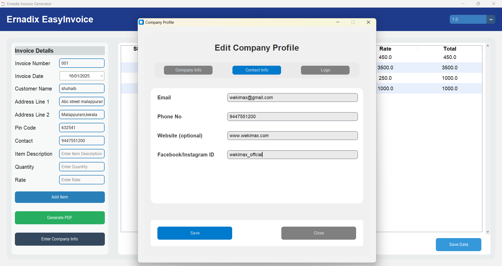
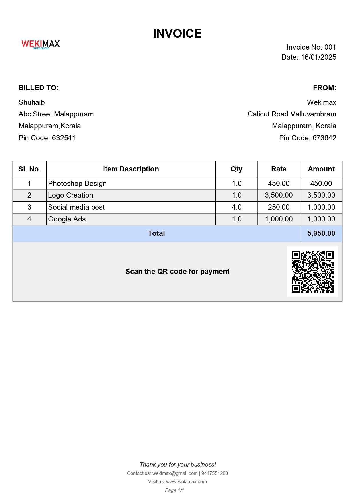
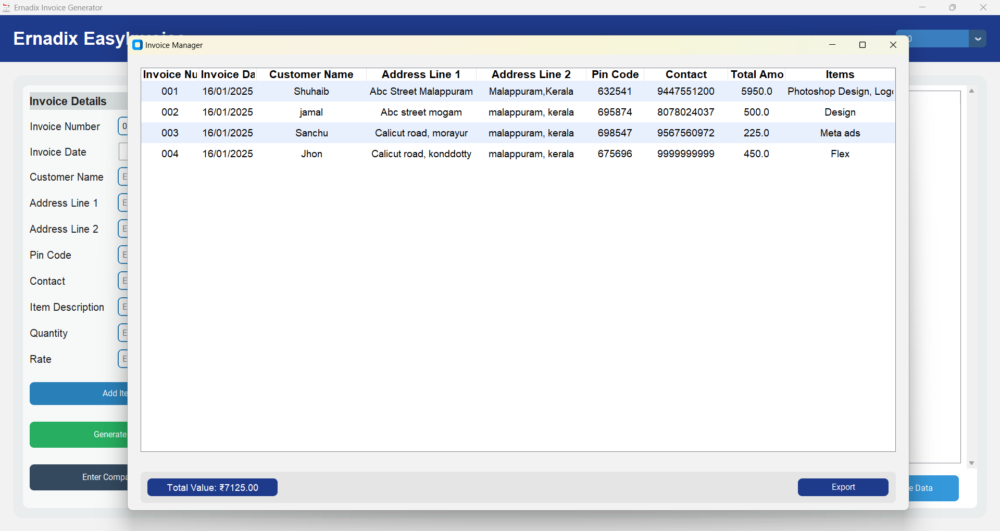

# 🧾 Ernadix EasyInvoice Generator

**Ernadix EasyInvoice Generator** is a powerful, user-friendly desktop application designed for small businesses and freelancers to create professional invoices with integrated UPI payment solutions. Generate invoices in seconds, track your revenue, and get paid faster with built-in QR codes.

---

## 📋 Table of Contents

- [Features](#-features)
- [Screenshots](#-screenshots)
- [Quick Start](#-quick-start)
- [Installation](#-installation)
- [How to Use](#-how-to-use)
- [Keyboard Shortcuts](#-keyboard-shortcuts)
- [System Requirements](#-system-requirements)
- [Technologies Used](#-technologies-used)
- [Pricing & License](#-pricing--license)
- [Support & Contact](#-support--contact)
- [FAQ](#-faq)
- [Future Roadmap](#-future-roadmap)

---

## ✨ Features

### 📄 Invoice Management
- **Professional Invoice Generation** - Create polished invoices in seconds
- **Real-time Preview** - See your invoice as you build it
- **Company Branding** - Add your logo and company information
- **Item Management** - Edit or delete items directly from the preview table

### 💳 Payment Integration
- **UPI QR Code Generation** - Automatic QR codes for seamless payments
- **Multiple Payment Methods** - Support for various UPI platforms
- **Instant Payment Links** - Share invoices with embedded payment options

### 📊 Business Intelligence
- **Hidden Dashboard** - Access via `Ctrl + D` for complete privacy
- **Revenue Tracking** - Monitor total earnings at a glance
- **Data Export** - Export all records for accounting and analysis
- **Local Database** - Secure SQLite storage for all your data

### 🎨 User Experience
- **Modern Interface** - Built with CustomTkinter for a sleek look
- **Keyboard Shortcuts** - Power-user friendly with extensive hotkeys
- **Offline Operation** - Works completely offline, no internet required
- **Quick Actions** - Save data without generating invoices

---

## 📸 Screenshots

### Main Invoice Generator Interface

*Clean, intuitive interface for quick invoice creation*

### Company Information Setup

*Easy company profile setup with logo upload*

### Sample Generated Invoice

*Professional invoice with integrated UPI QR code*

### Hidden Dashboard

*Comprehensive dashboard for data management and analytics*

---

## 🚀 Quick Start

1. **Download** the latest version from our [releases page](https://github.com/shuhaibvvm/Ernadix-EasyInvoice/releases/download/v1.5/Ernadix.easyinvoice.zip)
2. **Extract** the zip file to your desired location
3. **Run** `setup.exe` to install the application
4. **Launch** and start creating professional invoices immediately!

---

## 💻 Installation

### Step-by-Step Installation Guide

1. **Download the Software**
   - Visit our [releases page](https://github.com/shuhaibvvm/Ernadix-EasyInvoice/releases/download/v1.5/Ernadix.easyinvoice.zip)
   - Download the latest `Ernadix.easyinvoice.zip` file

2. **Extract the Files**
   - Right-click the downloaded zip file
   - Select "Extract All" or use your preferred extraction tool
   - Choose a destination folder

3. **Install the Application**
   - Navigate to the extracted folder
   - Double-click `setup.exe`
   - Follow the installation wizard
   - Choose installation directory (default recommended)

4. **First Launch**
   - Run the application from your desktop shortcut or start menu
   - Set up your company information on first launch
   - Start generating invoices immediately!

---

## 📖 How to Use

### Creating Your First Invoice

1. **Launch the Application**
   - Open Ernadix EasyInvoice from your desktop or start menu

2. **Set Up Company Information** (First Time Only)
   - Enter your business name, address, and contact details
   - Upload your company logo (optional but recommended)
   - Configure your UPI payment details

3. **Fill Invoice Details**
   - **Customer Information**: Name, address, contact details
   - **Invoice Details**: Invoice number, date, due date
   - **Items**: Description, quantity, rate, tax (if applicable)

4. **Preview and Generate**
   - Review your invoice in the preview pane
   - Make any necessary edits
   - Click "Generate Invoice" to create the PDF

5. **Share and Get Paid**
   - Share the generated invoice with your customer
   - They can scan the QR code for instant UPI payment
   - Track payments through the dashboard

### Managing Your Data

- **Access Dashboard**: Press `Ctrl + D` to open the hidden dashboard
- **View All Records**: See all your invoices and customer data
- **Export Data**: Click the export button to download your records
- **Monitor Revenue**: Check your total earnings at the bottom of the dashboard

---

## ⌨️ Keyboard Shortcuts

| Shortcut | Action |
|----------|--------|
| `Ctrl + R` | Clear all entered data in the invoice form |
| `Ctrl + A` | Add or update an item to the invoice |
| `Ctrl + D` | Open the hidden dashboard |
| `Ctrl + G` | Generate PDF invoice |
| `Ctrl + S` | Save data to dashboard without creating invoice |

---

## 🖥️ System Requirements

### Minimum Requirements
- **Operating System**: Windows 10 (64-bit) or later
- **RAM**: 4 GB minimum, 8 GB recommended
- **Storage**: 100 MB available disk space
- **Display**: 1024x768 resolution minimum
- **Internet**: Not required for operation (offline capable)

### Recommended Requirements
- **Operating System**: Windows 11 (64-bit)
- **RAM**: 8 GB or more
- **Storage**: 500 MB available disk space
- **Display**: 1920x1080 resolution or higher
- **Processor**: Intel i3 or AMD equivalent

---

## 🛠️ Technologies Used

- **Python 3.9+** - Core programming language
- **CustomTkinter** - Modern UI framework for beautiful interfaces
- **SQLite** - Lightweight, local database for data storage
- **qrcode** - QR code generation for UPI payments
- **Pillow (PIL)** - Image processing for logos and graphics
- **ReportLab** - PDF generation engine

---

## 💰 Pricing & License

### Current Pricing
**License Fee**: ₹2,000 (One-time payment)

> ⚠️ **Important**: Prices are subject to change. Please confirm current pricing before making payment.

### What's Included
- ✅ Lifetime license for single user
- ✅ Free updates for 1 year
- ✅ Email support
- ✅ Installation assistance
- ✅ Basic training materials

### Payment Methods

**UPI Payment**
- **UPI ID**: `suhaibvbm-1@oksbi`
- **Scan QR Code**:
  
  

**Bank Transfer** (Contact for details)
- **Phone**: +91 9567560972, +91 8078024037
- **Email**: [Ernadixofficial@gmail.com](mailto:Ernadixofficial@gmail.com)

### License Activation
1. Make payment using any of the above methods
2. Contact us via WhatsApp, call, or email
3. Provide payment confirmation details
4. Receive your license key within 24 hours
5. Activate the software and start invoicing!

---

## 🆘 Support & Contact

### Get Help
- **Email Support**: [Ernadixofficial@gmail.com](mailto:Ernadixofficial@gmail.com)
- **WhatsApp Support**: +91 9567560972
- **Phone Support**: +91 8078024037
- **Business Hours**: Monday to Saturday, 9 AM to 6 PM IST

### Connect With Us
- **Instagram**: [@ernadixofficial](https://www.instagram.com/ernadixofficial)
- **Website**: Coming Soon
- **LinkedIn**: Coming Soon

### Before Contacting Support
1. Check the [FAQ section](#-faq) below
2. Ensure you're using the latest version
3. Have your license key ready (if applicable)
4. Describe your issue clearly with screenshots if possible

---

## ❓ FAQ

### General Questions

**Q: Do I need an internet connection to use the software?**
A: No, the software works completely offline. Internet is only needed for downloading and initial setup.

**Q: Can I use this on multiple computers?**
A: The standard license is for single-user, single-computer use. Contact us for multi-user licensing options.

**Q: Is my data secure?**
A: Yes, all data is stored locally on your computer using SQLite database. No data is transmitted to external servers.

### Technical Questions

**Q: What file formats can I export?**
A: Invoices are generated as PDF files. Dashboard data can be exported as CSV files.

**Q: Can I customize the invoice template?**
A: Currently, the template is fixed but professional. Custom templates are planned for future versions.

**Q: What if I lose my license key?**
A: Contact our support team with your payment details, and we'll help you recover your license.

### Payment & Licensing

**Q: Do you offer refunds?**
A: We offer a 7-day money-back guarantee if the software doesn't meet your needs.

**Q: Are there any recurring fees?**
A: No, it's a one-time payment for lifetime usage. Updates are free for the first year.

---

## 🚀 Future Roadmap

### Version 2.0 (Planned)
- **GST Compliance**: Full GST invoice support with automated calculations
- **Custom Templates**: Multiple invoice templates to choose from
- **Multi-language Support**: Hindi, Tamil, and other regional languages
- **Advanced Analytics**: Charts and graphs for business insights

### Version 2.5 (Planned)
- **Cloud Backup**: Optional cloud storage for data safety
- **Mobile App**: Companion mobile app for on-the-go invoicing
- **API Integration**: Connect with popular accounting software
- **Multi-currency Support**: International business support

### Long-term Vision
- **AI-powered Features**: Smart invoice suggestions and fraud detection
- **Inventory Management**: Basic inventory tracking capabilities
- **CRM Integration**: Customer relationship management features
- **Team Collaboration**: Multi-user workspace features

---

## 📄 License

This project is licensed under **Proprietary License**.

- ✅ Licensed users may use the software for commercial purposes
- ❌ Redistribution, modification, or reverse engineering is prohibited
- ❌ Source code is not available for public use
- ✅ Users receive lifetime usage rights upon payment

For detailed licensing terms, please contact our support team.

---

## 🙏 Acknowledgments

- Thanks to all our beta testers who provided valuable feedback
- Special thanks to the Python and CustomTkinter communities
- Icons and graphics sourced from open-source projects

---

## 📊 Statistics

- **Downloads**: Starting Soon
- **Active Users**: Getting Started
- **Customer Satisfaction**: New Product
- **Average Invoice Generation Time**: 2 minutes

---

*Last Updated: July 2025*

**© 2025 Ernadix. All rights reserved.**
